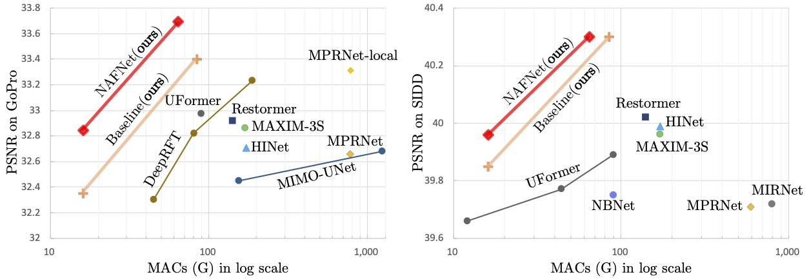

## Nonlinear Activation Free Network for Image Restoration

#### Liangyu Chen\*, Xiaojie Chu\*, Xiangyu Zhang, Jian Sun

>Although there have been significant advances in the field of image restoration recently, the system complexity of the state-of-the-art (SOTA) methods is increasing as well, which may hinder the convenient analysis and comparison of methods. 
>In this paper, we propose a simple baseline that exceeds the SOTA methods and is computationally efficient. 
>To further simplify the baseline, we reveal that the nonlinear activation functions, e.g. Sigmoid, ReLU, GELU, Softmax, etc. are **not necessary**: they could be replaced by multiplication or removed. Thus, we derive a Nonlinear Activation Free Network, namely NAFNet, from the baseline. SOTA results are achieved on various challenging benchmarks, e.g. 33.69 dB PSNR on GoPro (for image deblurring), exceeding the previous SOTA 0.38 dB with only 8.4% of its computational costs; 40.30 dB PSNR on SIDD (for image denoising), exceeding the previous SOTA 0.28 dB with less than half of its computational costs.

### Code will be available soon.

### Contact

If you have any questions, please contact chenliangyu@megvii.com or chuxiaojie@megvii.com
